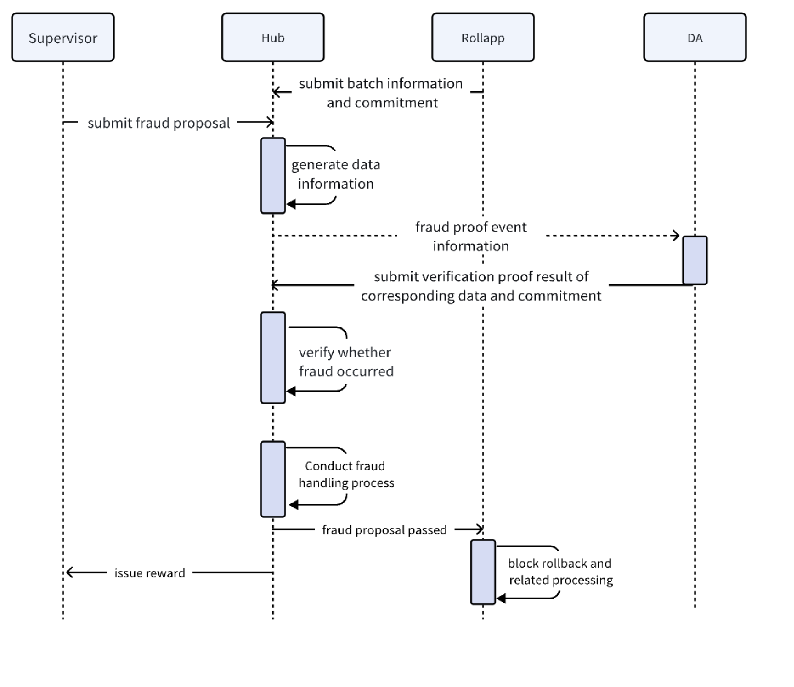

# ME Hub Economic Model

## Overview

ME Hub adopts an inflationary token economic model, implementing decentralized governance and reward distribution through the concept of Regions. This document details ME Hub's token supply, staking mechanisms, node account system, and revenue distribution methods.

## Token Supply

### Total Supply

- **Total Supply**: 20 billion MEC
- **Token Symbol**: MEC
- **Minimum Unit**: uMEC (1 ME = 10^8 uMEC)

### Pre-mining

ME Hub adopts a pre-mining mechanism, minting some tokens in genesis for ecosystem development, team incentives, and community distribution.

- **Total Pre-mining**: 10 billion MEC
- **Percentage of Total**: 50%

**Pre-mining Allocation**:
- **Ecosystem Fund**: Used for project development and marketing
- **Team Incentives**: Team member incentives, usually with lock-up periods
- **Community Airdrops**: Rewards for early users and community contributors
- **DAO Treasury**: Decentralized governance reserve fund
- **Region Initialization**: Providing initial reward pools for newly created regions

### Inflation Mechanism

ME Hub adopts a halving inflation model, implementing token issuance through the `wmint` module.

#### Inflation Parameters
The system's core parameters define the issuance logic: the total minting target for the first year is set at 5 billion MEC. Based on a block generation speed of approximately 5 seconds, the annual total block count is estimated at about 6.3 million blocks. Accordingly, in the initial phase, each block will generate approximately 792 MEC tokens.

#### Inflation Calculation Formula

Annual minting follows exponential decay logic, meaning each year's annual minting quota is half of the previous year.
Starting from `April 10, 2024, 00:00:00` UTC+0 time, every 365 days (6,307,200 blocks), block rewards are halved.

##### Halving Period Calculation

The system determines which halving period (year) the current block belongs to through the following formula:

```
N = ⌊(blockHeight - 1) / 6,307,200⌋
```

Where:
- `N` is the halving period number (0 represents year 1, 1 represents year 2, and so on)
- `blockHeight` is the current block height
- `6,307,200` is the total number of blocks per year (approximately 365 days × 24 hours × 3600 seconds / 5 seconds)
- `⌊⌋` represents rounding down

##### Tokens Per Block Calculation Formula

```
coins_per_block = (5 × 10⁹) / (2^N × 6,307,200)
```

Or expressed in fractional form:

```
                        5,000,000,000
coins_per_block = ─────────────────────────
                       2^N × 6,307,200
```

Where:
- `N` is the halving period number `⌊(blockHeight-1)/6,307,200⌋`
- `5,000,000,000` is the first year's total minting amount (5 billion MEC)
- `6,307,200` is the total number of blocks per year
- **Key Characteristic**: **Within the same halving period (same year), the N value remains constant, therefore the tokens per block amount is fixed**
- Only when the block height crosses a multiple of 6,307,200 does N increase by 1, and the token issuance halves

**Examples**:
- Block height 1 ~ 6,307,200: N = 0, 792.7448 MEC per block (year 1)
- Block height 6,307,201 ~ 12,614,400: N = 1, 396.3724 MEC per block (year 2)
- Block height 12,614,401 ~ 18,921,600: N = 2, 198.1862 MEC per block (year 3)

**Minting Mechanism**:
The system automatically calculates which year the current height belongs to at the beginning of each block (BeginBlocker), dynamically adjusting the number of tokens that should be generated for the current block. All newly minted tokens are directly transferred to the **Treasury Pool** address for unified management. Additionally, the system has a built-in strict cap audit mechanism that stops issuance once the cumulative minting reaches the preset total of 10 billion MEC, ensuring the soundness of monetary policy.

#### Annual Inflation Table

| Year | Annual Minting | Per Block Minting | Cumulative Minting | Inflation Rate (relative to total) |
|:-----|:---------------|:------------------|:-------------------|:-----------------------------------|
| 1    | 5B MEC         | 792.7448 MEC      | 5B MEC            | 25.0%                              |
| 2    | 2.5B MEC       | 396.3724 MEC      | 7.5B MEC          | 12.5%                              |
| 3    | 1.25B MEC      | 198.1862 MEC      | 8.75B MEC         | 6.25%                              |
| 4    | 625M MEC       | 99.0931 MEC       | 9.375B MEC        | 3.125%                             |
| 5    | 312.5M MEC     | 49.5466 MEC       | 9.6875B MEC       | 1.5625%                            |
| ... | ... | ... | ... | ... |
| ∞    | Approximately 0 | Approximately 0   | Approximately 10B MEC | Approximately 0%                |

**Explanation**: 
- Total inflation approaches 10 billion ME, adding to the pre-mined amount for a total of 20 billion ME
- Minted tokens are sent to the Treasury Pool module account, distributed uniformly by the Wdistri module
- Block time is approximately 5 seconds, with about 6,307,200 blocks per year
- Reward distribution is triggered every 17,280 blocks (approximately one day)

## Validator Node System

### Node Account Structure

ME Hub adopts the concept of Regions, where each region represents a validator node's management domain. A complete region definition includes: unique region ID, display name, creator address, operator address responsible for signing blocks, associated rights certificate (NFT Class ID), dedicated regional treasury address, fixed deposit interest pool address, and the region's weight share in the network. Additionally, the system records total staking interest, total staked amount, and total fixed deposits within the region.

### Node Account Types

Each region contains the following dedicated accounts:

#### 1. Region Treasury

**Functions**:
- Manages the region's main fund pool, storing staked tokens and serving as the source for reward distribution in the region.
- Its account address is uniquely generated through hashing the region ID with a specific prefix.
- During region initialization, the system automatically registers and activates the treasury account in the ledger.

#### 2. Operator Address

**Functions**:
- Validator node's operational control address
- Used for signing blocks and participating in consensus
- Can be set and updated by the region creator

**Permissions**:
- Create and manage validators
- Modify commission rates
- Update node description information

#### 3. Validator Reward Pool

**Functions**:
- Accumulates block rewards for validator nodes
- Records staking interest for each region
- Distributes staking rewards to delegators

**Reward Accumulation Mechanism**:
At the beginning of each block (BeginBlock), the system obtains the total amount of newly generated tokens for the current block. Subsequently, it traverses all valid regions, injecting corresponding rewards into each region's interest pool based on their staking weight.

#### 4. Governance Reward Pool

**Functions**:
- DAO governance participation rewards
- Proposal voting incentives
- Community contribution rewards

**Global DAO Fee Pool**:
The system maintains a global DAO fee pool address. If the address doesn't exist, it's automatically generated and initialized through a hash algorithm based on the predefined name.

#### 5. Fixed Deposit Interest Pool

**Functions**:
- Manages fixed-term deposit interest
- Supports multiple fixed-term configurations
- Automatically releases principal and interest upon maturity

### Initial Stake Amount

Each validator node must meet a minimum staking requirement (such as 0.01 MEC) upon creation.

**Validator Creation Process**:
During creation, the system first verifies the submitted public key type and its validity. Then, it initializes the validator object, setting the initial commission rate, maximum commission rate cap, and allowed maximum change range. Finally, it specifies the node owner and minimum self-delegation amount, and executes the initial staking transfer operation.

**Important Notes**:
- The initial staking amount must be specified by the creator when creating the validator
- Commission rate parameters (initial ratio, maximum cap, maximum change range) are set in the create-validator message
- Minimum self-delegation threshold (MinSelfDelegation) is also specified at creation time
- Once created, some of these parameters can be adjusted through the edit-validator function

## Node Revenue Methods

### Revenue Sources

Validator nodes and delegators can earn revenue through the following methods:

#### 1. Block Rewards

**Source**: Newly issued tokens per block  
**Distribution**: Distributed to all active validator nodes proportionally by staking weight

**Calculation Formula**:

```
Region Reward = Total Reward Per Block × (Region Staking Amount / Total Network Staking Amount)
```

#### 2. Transaction Fees

**Source**: GasFee paid by users for transactions  
**Distribution**: Block proposer receives additional rewards, the rest distributed by staking weight

---

## Detailed Staking Operations

### ME ID Registration Reward

**Reward Types**:
The system has built-in clear identity verification incentive standards:
- **Bonus (Registration Incentive)**: 1 MEC, recorded in the Unmovable field of staking information, non-transferable but participates in interest calculation
- **InviteReward (Invitation Reward)**: 0.1 MEC, sent directly to the inviter's account
- **ValidatorReward (Node Reward)**: 0.01 MEC, sent to the validator owner address
- **CommitteeReward (Committee Reward)**: 0.01 MEC, sent to the development operation committee address

**ME ID Reward Distribution Process**:
After ME ID approval, the system automatically triggers the reward distribution process:
1. **Registration Incentive**: Records 1 MEC (Bonus) to the user's staking information Unmovable field, which cannot be directly transferred but participates in interest calculation
2. **Validator Reward**: Transfers 0.01 MEC node maintenance reward to the validator owner address (OwnerAddress)
3. **Committee Reward**: Transfers 0.01 MEC protocol operation reward to the development operation committee address (DevOperator)
4. **Invitation Reward**: If there's an inviter, transfers 0.1 MEC to the inviter's account
5. **Status Update**: Increases the validator's MeidAmount by 1 MEC, recording it in the validator's allocated ME ID quota, and resets the user's interest calculation start height

### Reward Distribution Timing

#### BeginBlock Phase

At the beginning of each block, the system records the proposer's consensus address for subsequent reward tracking.

#### EndBlock Phase

At the end of each block, the system executes the following logic:
1. **Reward Distribution Trigger**: Every time the block height is a multiple of 17,280 (approximately one day), a global reward distribution is triggered
2. **Calculate Region Weights**: Traverses all active regions, distributing based on each region's staking amount (RegionShare) proportion to total network staking
3. **Fund Transfer**: Transfers rewards from Treasury Pool to each region's treasury address (RegionTreasureAddr) proportionally
4. **Validator Set Update**: Processes dynamic changes to the validator set, submitting the final validator update list to the consensus engine

## Staking Mechanisms

ME Hub supports two staking methods: **Flexible-Term Staking** and **Fixed-Term Staking**, meeting different users' liquidity needs and return expectations.

### Flexible-Term Staking

#### Overview

Flexible-term staking is a staking method where users can flexibly manage their principal. Users' principal is stored in the module account `bonded_tokens_pool`, while interest is paid by the node staking treasury. All flexible-term staking users have the same interest calculation method and yield rate.

#### ME ID User Flexible-Term Staking

**Characteristics**:
- **Staking Range**: ME ID users can only stake in their own region
- **Withdrawal Speed**: Principal can be withdrawn at any time
- **Auto-Creation**: After ME ID authentication, the system automatically creates a flexible-term staking account and records 1 MEC unmovable balance (Unmovable)

**Operation Process**:
1. **Create/Increase Staking**
   - ME ID users automatically create flexible-term staking after authentication
   - Subsequently can only add principal through increase staking function
   - Each time principal is added, the chain automatically settles current interest and sends it to the user

2. **Exit/Reduce Staking**
   - Users can reduce staking amount at any time
   - If the reduced amount exceeds actual staking amount, system defaults to processing by actual amount
   - Reducing staking also triggers interest settlement

#### Non-ME ID User Flexible-Term Staking

**Characteristics**:
- **Staking Range**: Non-ME ID users can only stake in the **Experience Zone**
- **Withdrawal Restriction**: Withdrawing principal requires **7-day lock**, credited after 7 days
- **Account Conversion**: If non-ME ID users complete ME ID authentication, existing flexible-term staking automatically converts to ME ID flexible-term staking, simultaneously settling previous interest

**Operation Process**:
1. **Create Staking**
   - First staking automatically creates flexible-term staking account
   - Can continue to add staking subsequently

2. **Exit Staking**
   - After submitting exit request, principal enters 7-day unbonding period
   - No yield during unbonding period
   - Principal automatically returns to user account after 7 days

#### Interest Calculation and Distribution

**Region Interest Pool**:
Each region has a `DelegateInterest` field to record remaining unpaid interest (interest to be claimed) for flexible-term staking in the current region.

**Interest Calculation**:
The system dynamically calculates interest based on staking amount and blocks passed since last settlement:

```
Interest = Total Staked Assets × Region Instant Yield Rate × Holding Blocks
```

Where total staked assets include:
- Regular staking amount
- ME ID related amount

**Interest Withdrawal**:
When users initiate a withdrawal request or perform staking operations:
1. System calculates total accumulated interest since start height
2. Checks if target region's treasury interest pool has sufficient balance
3. If balance is sufficient, interest is transferred from region treasury to user account
4. Automatically updates the reward settlement height for this staking relationship to current block

### Fixed-Term Staking

#### Overview

Fixed-term staking provides pre-configured lock-up periods and corresponding annual percentage rates (APR). Users must choose from existing configurations when staking to lock and earn yields. Staking periods and their APRs are initialized or modified by region administrators (or region DAO), users cannot define custom periods.

#### Configuration Rules

**1. Period Configuration Authority**
- Fixed-term staking periods are initialized and managed by region administrators or region DAO, with periods in **days** (positive integers).
- Users can only choose from existing period configurations to initiate staking, cannot customize or submit custom periods.
- Each period in a region can only have one unique configuration; if changes to period or interest rate are needed, must be completed by region administrator through configuration interface or governance process.

**2. Region Independence**
- Each region's (such as USA region, Germany region) staking periods and corresponding APRs are independently configured and don't affect each other.
- Example:
   - USA Region: Administrator configures 3-day and 54-day staking with rates of 2% and 3% respectively
   - Germany Region: Administrator configures 54-day staking with rate of 3%

#### Function Interfaces

**1. Configuration Management**
- **Configure Region Fixed-Term**: Allows adding new fixed-term staking configurations
- **Activate Configuration (Set ACTIVE)**: Sets a configuration status to ACTIVE, users can stake
- **Close Configuration (Set INACTIVE)**: Sets a configuration status to INACTIVE, closes staking entrance, but existing orders unaffected
- **Delete Configuration**: Deletes a period's staking configuration, frontend no longer displays this configuration

**2. Interest Rate Management**
- **Set Interest Rate**: Can adjust APR for existing configurations
- **Adjustment Rules**: Adjustments **only affect new orders**, old orders still calculated by APR at creation time

**3. Query Functions**
- **Query by Region**: Query all staking configurations for a region
- **Query by Region ID and Configuration ID**: Query for a specific staking configuration

#### Fixed-Term Staking Characteristics

1. **Lock-up Period**: Funds locked during staking period, cannot be redeemed early
2. **Fixed Returns**: Calculates returns based on APR at creation time, unaffected by subsequent rate adjustments
3. **Manual Withdrawal Required Upon Maturity**: Principal and interest are not automatically returned upon maturity, users must actively call the withdrawal interface to extract principal and returns.
4. **Higher Yield Rate**: Compared to flexible-term staking, fixed-term staking provides higher APR

### Staking Returns Comparison

| Feature | Flexible-Term Staking (ME ID) | Flexible-Term Staking (Non-ME ID) | Fixed-Term Staking |
|:--------|:------------------------------|:----------------------------------|:-------------------|
| Liquidity | Withdraw anytime | 7-day unbonding | Cannot withdraw during lock period |
| Yield Rate | Base yield rate | Base yield rate | Higher APR |
| Staking Region | Own region | Experience zone | Own region |
| Principal Security | High | High | High |
| Applicable Scenarios | Need flexibility | Trial users | Long-term holding |
| Initial Balance | 1 MEC Unmovable | None | None |

---

## Mining and Reward Distribution Mechanism

### Wmint Module: Token Minting

**Function**:
Each block generation triggers mining rewards, with generated tokens transferred to **treasury_pool** address.

**Technical Implementation**:
- Wmint module's Keeper inherits mint module's keeper
- Modified BeginBlocker rules to implement custom minting logic

**Minting Process**:
1. Triggered in BeginBlock phase of each block
2. Calculates number of tokens to be generated based on current block height
3. Minted tokens directly transferred to treasury_pool module account
4. Records cumulative minting amount, ensuring not to exceed 10 billion MEC cap

### Wdistri Module: Reward Distribution

**Function**:
Distributes mining rewards proportionally based on region staking amounts.

**Technical Implementation**:
- Wdistri module's Keeper inherits most functions of distribution keeper
- Extended region-level reward distribution logic

#### Reward Distribution Formula

```
RegionReward = (RegionShared / TotalRegionShared) × TreasuryPoolBalance
```

Or in fractional form:

```
                     RegionShared
RegionReward = ────────────────────── × TreasuryPoolBalance
                   TotalRegionShared
```

Where:
- `RegionReward`: Reward received by the region
- `RegionShared`: Total staking amount for the region
- `TotalRegionShared`: Total staking amount across all regions network-wide
- `TreasuryPoolBalance`: Balance of tokens available for distribution in treasury pool

#### Distribution Trigger Timing

**1. Regular Distribution**
- Distribution triggered every **17,280 blocks** (approximately one day)
- Ensures regular reward distribution

**2. State Change Trigger**
In the following situations, the system triggers a reward distribution **before** the change occurs:
- Validator changes
- Node staking amount changes
- New region creation

This mechanism ensures that before state changes, all undistributed rewards are correctly settled according to the old state, avoiding equity loss.

#### Distribution Process

1. **Calculate Region Weights**
   - Traverse all active regions
   - Calculate each region's staking amount proportion to total network staking

2. **Distribute Rewards**
   - Transfer tokens from treasury_pool module account to each region's treasury address (RegionTreasureAddr) according to weight proportion
   - Formula: Region Reward = (Region Staking Amount / Total Network Staking Amount) × Treasury Pool Balance
   - Region treasury used to pay staking interest for all users within the region

3. **Record Distribution Events**
   - Send RegionTreasuryReward event
   - Record region ID, treasury address, and distribution amount
   - Used for auditing and tracing

### Reward Hierarchy Distribution

ME Hub's reward distribution adopts a **three-tier structure**:

```
Treasury Pool
    ↓
Region Interest Pool
    ↓
User Account
```

**Responsibilities at Each Level**:

1. **Treasury Pool**
   - Receives newly minted tokens each block
   - Distributes to each region's interest pool according to region weights

2. **Region Interest Pool**
   - Receives rewards distributed from Treasury Pool
   - Manages interest for all stakers within the region
   - Distributes to users according to staking proportion

3. **User Account**
   - Users claim returns from region interest pool through withdrawal operations
   - Or automatically settle returns during staking operations

**Staking Process**:
When processing user staking requests, the system executes the following steps:
1. **Minimum Amount Verification**: Verifies if staking amount meets minimum threshold (currently set to greater than 0, and remaining amount after unbonding must be 0 or greater than minimum value)
2. **Region Verification**: Gets the user's region based on account, automatically routing staking to that region's validator
3. **Interest Settlement**: If user has existing staking, first calculates and pays accumulated interest from last settlement to current
4. **Fund Transfer**: Transfers staking funds from user account to staking pool (BondedPool or NotBondedPool)
5. **Status Update**:
   - Increases staking amount in staking record (Amount or UnMeidAmount)
   - Updates staking start height (StartHeight) to current block
   - Increases validator's total staking amount (DelegationAmount)
   - Increases region's total staking amount (DelegateAmount)
6. **Event Recording**: Sends staking event, recording all key parameters

#### Unstaking

**Unbonding Process**:
When users decide to unstake, the system executes the following steps:
1. **Interest Settlement**: Calculates and pays all accumulated interest from last settlement to current
2. **Unbonding Amount Confirmation**:
   - If requested unbonding amount exceeds actual staking amount, processes by actual amount for full unbonding
   - If remaining amount after unbonding is less than minimum threshold, forces full unbonding
3. **Fund Processing**:
   - **ME ID Users**: Funds directly return from BondedPool to user account, managed through UnbondingDelegation queue
   - **Non-ME ID Users**: Funds transfer from BondedPool to NotBondedPool, also entering 7-day unbonding period
4. **Status Update**:
   - Reduces staking amount in staking record
   - Reduces validator's total staking amount (DelegationAmount)
   - Reduces region's total staking amount (DelegateAmount)
   - Reduces region's interest pool balance (DelegateInterest)
5. **Unbonding Queue**: Inserts unbonding record into queue, with final transfer automatically completed by EndBlocker after 7 days

---

## Fraud Handling Mechanism Analysis

The Rollup fraud mechanism is based on optimistic fraud handling. Fraud proposals are submitted by supervisors, and the settlement layer judges and processes them. However, they must be submitted within a certain time window. If the window is exceeded, the data is confirmed, and no fraud proposal can be submitted for that data.

### 1. Processing Flow

The fraud handling mechanism involves Rollup, Hub, and DA. It covers the process from submission to on-chain fraud evidence data verification and punishment. The collaboration process is as follows:



### 2. Fraud Proposal Submission

#### 2.1 Submission Timeliness

When submitting a fraud proposal for a Rollup's data, the data must still be within the dispute period. If the dispute period has passed, it means the data has been confirmed and a fraud proposal can no longer be submitted.

The time window for the dispute period is configured at the HUB layer.

#### 2.2 Interface Parameters

Important interface parameters involved in fraud proposals:

| Field | Type | Description |
|:-----|:-----|:------------|
| `description` | string | Description information |
| `rollup_id` | string | Target Rollup ID |
| `mbc_client_id` | string | Rollup's MBC client ID |
| `fraudelent_height` | uint64 | Block height where fraud occurred |
| `fraudelent_sequencer_address` | string | Address of the malicious Sequencer |

### 3. Fraud Penalties and Rewards

#### 3.1 Punishment Measures

After the HUB layer compares the data commitment submitted by the Rollup with the proof information submitted by DA and finds:

- **If the Rollup's data is not fraudulent**, the proposer's staked funds will be slashed
- **If the Rollup's data fraud is confirmed**, the following punishments will be enforced:
  - **The Rollup is frozen**
  - **The malicious Sequencer address of the Rollup is set to Jailed**
  - **The stake of the malicious Sequencer address is slashed**
  - **Other sequencer addresses bound to the Rollup are unbonded and their stakes are returned**
  - **The MBC client is frozen, and all pending MBC packets for that Rollup are rolled back**

#### 3.2 Rewards

If the Rollup's data is confirmed to be fraudulent, the proposer will receive a portion of the slashed stake as a reward.

---

## DAO Governance

### DAO Account System

ME Hub adopts a multi-level DAO governance structure, with core components including:

1. **Global DAO**:
   - Has the highest level of governance authority, responsible for updating core protocol parameters, managing DAO membership, and allocating control rights for fee pools.

2. **ME ID DAO**:
   - Specifically responsible for managing identity verification logic based on ME ID NFT, handling ME ID verification issuance and identity system governance rules.

3. **Dev Operator Address**:
   - Specifically receives committee rewards from protocol shares, used to support continuous R&D of public chain protocol, performance optimization, and rolling upgrades of underlying technology.

4. **Airdrop Address**:
   - Holds and executes community incentive fund distribution, managing execution details of airdrop activities.

### Governance Proposals

Governance proposal types include:

1. **Parameter Change Proposals**: Modify chain parameters (inflation rate, Gas price, etc.)
2. **Software Upgrade Proposals**: Chain upgrade voting
3. **Text Proposals**: Community decisions and suggestions
4. **Funding Proposals**: DAO treasury fund expenditure

## Key Economic Model Features

### 1. Deflationary Mechanisms

Although there is inflationary issuance, the following mechanisms produce deflationary effects:

- **Reward Halving**: Block reward halving mechanism
- **Staking Lock**: Large amounts of tokens locked in staking
- **Fixed-Term Staking**: Long-term lock-up reduces circulation

### 2. Incentive Alignment

Economic model design ensures all parties' interests are aligned:

- **Validators**: Benefit from block rewards, motivated to maintain network security
- **Stakers**: Participate in network value growth through staking returns
- **Developers**: Supported by DAO treasury and committee rewards for continuous development
- **Users**: Receive rewards through network usage and governance participation

### 3. Regional Autonomy

Each region manages independently:

- **Independent Treasury**: Regional treasuries are independently accounted
- **Autonomous Distribution**: Reward distribution within regions decided by the region
- **Weight Voting**: Regional weight affects global governance voting power

## GasFee Mechanism

ME Hub adopts a flexible GasFee strategy, supporting dynamic pricing, subsidy mechanisms, and anti-spam transactions, ensuring efficient network operation.

### Gas Calculation and Pricing

#### Basic Calculation Formula

```
adjusted_gas = base_gas × (1 + complexity_factor) + priority_fee
```

Where:
- `base_gas`: Transaction size + computation cost
- `complexity_factor`: Business complexity coefficient (0-2)
  - Regular transfers: 0
  - AMM trading: 0.3 × number of hops
  - Smart contracts: 1.5-2.0
  - Governance staking: 0.5

### Gas Subsidy Mechanism
  - Subsidy Contracts: Deploy smart contracts allowing users to authorize ME2.0 Treasury to pay Gas through signatures (similar to EIP-4337 account abstraction).
  - Whitelist Mechanism: Only verified ME2.0 ecosystem contracts (such as cross-chain bridges) can trigger subsidies.

### Anti-Sybil Attack
  - Fee Penalties: Implement exponential Gas growth for high-frequency small-amount transactions (possible wash trading) (such as gas = base_gas * (1.5)^n, where n is recent transaction count).
  - Priority Queue: High Gas fee transactions are prioritized for packing, avoiding blocking of ME2.0 critical business.

--- 

## Security Considerations

### 1. Permission Control
- Only region creators can modify region parameters
- DAO operations require governance proposal voting approval
- Validator operations require corresponding private key signature

### 2. Fund Security
System fund security is guaranteed by multiple mechanisms: all internal transfers must be accompanied by specific business tags for full-chain audit tracking; the system enforces minimum amount threshold checks and performs cryptographic verification of all transactions to filter overflow and negative values.

### 3. Reentrancy Attack Prevention
- State updates completed before external calls
- Use transactional operations to ensure atomicity
- Strict prevention of concurrent conflicts through locking mechanisms

### 4. Resource Control and Limits
To prevent Denial of Service (DoS) attacks, the system consumes corresponding Gas for each region creation task. Additionally, hard limits are set on the length of on-chain documents and metadata to prevent malicious abuse of resources.

## Future Extensions

### 1. Dynamic Inflation Adjustment
Dynamically adjust inflation parameters based on network usage and staking rate.

### 2. Liquid Staking
Support staking derivatives, allowing users to receive liquidity certificates after staking for use in DeFi.

### 3. Cross-chain Asset Staking
Support staking of assets from other ME chains through MBC.

### 4. MEV Distribution
Incorporate MEV (Miner Extractable Value) revenue into the economic model, fairly distributing to validators and stakers.

---
**Document Version**: v2.0.0  
**Last Updated**: 2026-02-09  
**Maintainer**: Meta Earth Development Team
