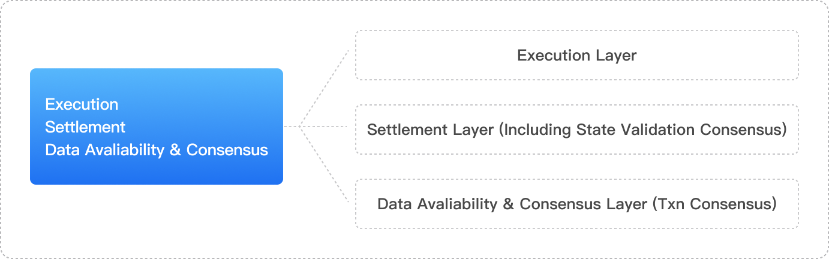
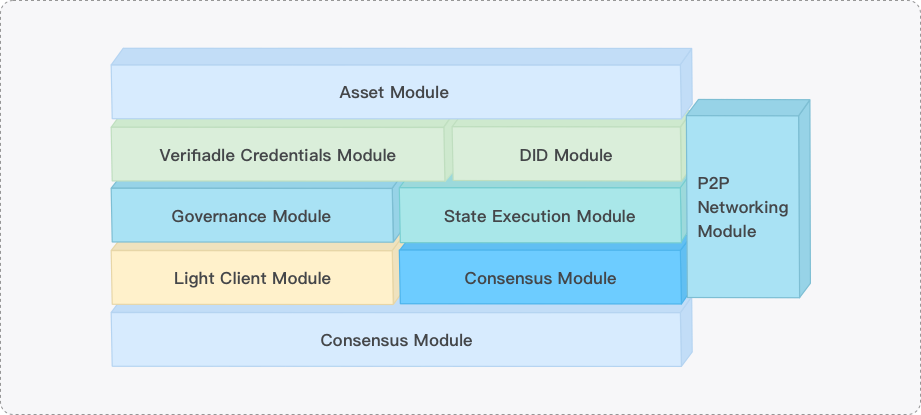

# ME Overall Architecture

## Overview

Meta Earth is an innovative modular blockchain platform that achieves higher flexibility and scalability by decomposing traditional monolithic chain functions into multiple independent layers. This document provides a detailed introduction to Meta Earth's technical architecture system and its advantages over traditional blockchains.

---

## Limitations of Monolithic Chains

### What is a Monolithic Chain

Blockchain technology initially adopted a **Monolithic Chain** design, a concept originating from the Bitcoin network and adopted by many blockchains (such as Ethereum 1.0). Monolithic chains integrate all functions (execution, consensus, data availability, and settlement) into a single system.

### Main Problems Faced by Monolithic Chains

#### 1. Performance Bottlenecks
- **Limited Processing Speed**: Blockchain transaction processing speed is significantly lower than Web 2.0 standards
- **Network Congestion**: As the number of applications increases, the network becomes increasingly congested
- **Rising GasFees**: Network congestion leads to continuously rising transaction fees

#### 2. Scalability Challenges
Although sidechain technologies and new public chains like Solana temporarily alleviate these problems, they also lead to fragmentation of the blockchain ecosystem. The launch of Cosmos and Polkadot enables developers to quickly build application chains, but the high cost of node operations also limits their development.

#### 3. Layer 2 Limitations
Layer 2 Rollup technologies (such as Arbitrum and Optimistic) alleviate the so-called "trilemma," but these solutions are still limited by the processing capacity of the main chain, and the high cost of block storage on the main chain also limits their potential for further optimization.

#### 4. Insufficient Adaptability (Bucket Theory)
A more serious problem is the inherent lack of "adaptability" in monolithic chains:

- If every node in the network must execute and validate every transaction, this limits the network's processing capacity to the hardware resources of the weakest node
- Causes severe resource waste and environmental pollution from electricity consumption
- System efficiency is limited by the weakest link
- Nodes bear more costs in maintaining consensus without receiving corresponding returns
- Certain nodes continuously become "bottlenecks" limiting the development of the entire system

---

## Modular Blockchain Solution

### Core Concept of Modular Blockchain

To thoroughly solve the problems of monolithic chains, the Modular Blockchain solution emerged:

**Modular Blockchain** is a new implementation approach in blockchain design that separates different types of functions into different components or modules in the blockchain network. This changes the traditional monolithic chain design pattern of integrating all functions into one system, marking a paradigm shift from monolithic chains to modular blockchains.

### Evolution of Modularity

#### Rollup: Pioneer of Modularity
The emergence of Rollup technology can be seen as a pioneer of the modular concept. It primarily focuses on separating the execution layer, with Rollup handling transaction execution and then packaging transaction results and information back to the main chain.

#### ME DA Layer Practitioner
ME as an early practitioner of modular blockchain set important reference standards for blockchain development. However, ME mainly focuses on the data availability layer (DA), excluding the execution layer, aimed at empowering other public chains.

#### Me Hub Execution Layer Supplement
ME Hub as the execution layer supplement solution for ME provides a new perspective for creating new blockchain networks. The launch of its testnet ME Hub also attracted widespread industry attention.

### Advantages of Modular Solutions

1. **Enhanced Scalability**
   - Each layer can scale independently without affecting other layers
   - Break through the performance limitations of monolithic chains

2. **True Flexibility**
   - Each layer can choose the most suitable technical solution
   - Support customized and specialized development

3. **Reduced Operational Costs**
   - Provide public consensus, computing nodes, and data availability (DA)
   - Reduce hardware costs and operational costs of the execution layer (Rollup)

### Unique Advantages of Meta Earth

What makes Meta Earth unique is:

1. **Modular Technical Architecture**
   - Separate data availability layer
   - Specially built ME Hub for settlement and state verification consensus

2. **Complete Development Toolchain**
   - Launch modular development toolkit
   - Provide comprehensive execution layer solutions

3. **Empowering Traditional Industries**
   - Specifically empower traditional industries such as RWA (Real World Assets) in blockchain transformation
   - Have competitive advantages over other modular blockchains

---

## Meta Earth Modular Architecture

Meta Earth is a modular blockchain with decoupling occurring in two main directions:

### Horizontal Decoupling

Following the modular approach, Meta Earth decouples into three main working layers:

1. **Execution Layer**
2. **Settlement Layer** - Including state verification consensus
3. **Data Availability & Consensus Layer** - Transaction consensus

### Vertical Decoupling

Meta Earth's vertical decoupling refers to the classification of blockchain business, organizing one or more related businesses into a collection according to specific rules, which we call "modules."

In Meta Earth's modular blockchain:
- Functions such as transaction broadcasting, account balance, consensus mechanism are handled by independent modules
- Rather than all functions being tightly integrated together
- This decoupling makes network maintenance easier and enhances scalability
- Allows for module reuse or replacement without affecting the entire Meta Earth system

### Architectural Advantages

Since Rollup chains are independent and customizable, more Rollup models and execution environments will emerge in the future, leading to changes in Meta Earth's settlement and consensus models. Additionally, Meta Earth's own performance must continuously adapt to technological advances. Therefore, **the combination of horizontal and vertical decoupling is undoubtedly the most promising and forward-looking blockchain architecture at present**.

This structure not only provides greater flexibility and scalability but also better adapts to evolving technology and market demands:

1. **Separation of Core Consensus and Transaction Execution**
   - Decouple transaction processing from settlement and consensus
   - Reduce resource occupation on the main chain

2. **Stable Data Availability**
   - Provide efficient resource invocation

3. **Independent Evolution After Business Type Decoupling**
   - Interact through dedicated interfaces
   - Allow different modules to be independently deployed and upgraded
   - Promote continuous evolution of Meta Earth

---

## Execution Layer

### Core Responsibilities

The execution layer is responsible for processing transactions and implementing interactions with smart contracts or ordinary transactions, effectively serving as the top layer in the blockchain technology stack.

### Implementation in Meta Earth

In Meta Earth, the most common example of the execution layer is **Rollup**, where computation is executed:

1. **Computation Processing**
   - Rollup publishes computation results (i.e., state root) to the settlement layer
   - Submits transaction data to the data availability layer (DA)

2. **Data Publishing**
   - State root information, DA commitments, and related data are published to ME Hub

3. **Performance Advantages**
   - Significantly reduce the burden on the main chain (ME Hub) by offloading transaction computation to Rollup
   - Achieve extremely high TPS (transactions per second)
   - Relatively low GasFee consumption

### ME Hub's Execution Capability

Although ME Hub (settlement layer) as an independent blockchain supports smart contracts itself, **deploying heavy applications on it is not encouraged** to maximize Rollup space. However, before implementing Rollup chain technology, it can serve as the execution layer.

---

## Settlement Layer

### Core Responsibilities

The settlement layer finalizes transactions by resolving disputes and verifying evidence, while bridging different execution layers. It receives states and results processed by the execution layer and reaches consensus on all processed states and results.

### Functions of ME Hub

In Meta Earth, the settlement layer is also called **ME Hub**, which provides additional functions:

#### 1. Rollup Chain Registration and Management
The settlement layer maintains a registry of deployed Rollup chains and key information:
- State information
- Staking information
- Sequencer list
- Sequencer management

Providing security and settlement services for Rollup chains.

#### 2. Bridging Hub
- If multiple Rollups share a common settlement layer, they can be bridged
- Eliminates the need to establish separate bridges between Rollups
- Enables seamless interoperability between Rollups

#### 3. Liquidity Source
- Liquidity in the settlement layer can be utilized by all upper-layer Rollups
- In addition to using main chain tokens, Rollups can create their own tokens
- Facilitate liquidity and free exchange through ME Hub settlement layer's natural cross-chain capability

### Reduced Operational Costs

In modular blockchains, the settlement layer provides basic consensus and security mechanisms for the execution layer, significantly reducing operational costs by eliminating the need to deploy validator nodes when building Rollup chains.

---

## Data Availability & Consensus Layer

### Core Responsibilities

Data availability is a key component for achieving Meta Earth's high scalability. It is responsible for receiving and storing execution layer business data, serving as a storage module for Rollup data, ensuring transaction data availability, allowing anyone to access and verify data, thus ensuring the "hard" security and consensus of the execution layer.

### Unique Functions of DA Layer

The Data Availability (DA) layer focuses on ensuring the correct availability of transaction data:

1. **Information Security Assurance**
   - Plays a crucial role in Meta Earth
   - Provides an additional layer of information security

2. **Lightweight Verification**
   - Does not participate in consensus maintenance
   - Does not store all transaction data
   - Validates transactions and proves their availability

### Performance Advantages

The DA layer has unique:
- Data distribution mechanisms
- Data propagation channels
- Storage capacity

These characteristics contribute to the efficient operation of the main chain (ME Hub), significantly enhancing Meta Earth's performance.

---

## Summary of Architectural Advantages

Meta Earth's modular architecture achieves the following through clear hierarchical division and standardized interfaces:

1. **High Scalability**
   - Each layer can scale independently without affecting other layers
   - Break through traditional blockchain performance limitations

2. **Flexible Technology Choices**
   - Each layer can choose the most suitable technical solution
   - Support continuous technological iteration and innovation

3. **Reduced Development Complexity**
   - Developers can focus on specific layers
   - Modular development lowers the learning curve

4. **Better Performance**
   - Targeted optimization of each layer
   - Overall performance significantly improved

5. **Enhanced Interoperability**
   - Support multi-chain ecosystem through standard interfaces
   - Facilitate cross-chain asset flow and data interaction

6. **Reduced Operational Costs**
   - Share infrastructure and security mechanisms
   - Reduce redundant construction and resource waste

This architectural design provides a solid foundation for building high-performance, scalable, and secure blockchain applications, enabling Meta Earth to better serve the blockchain transformation needs of traditional industries.
